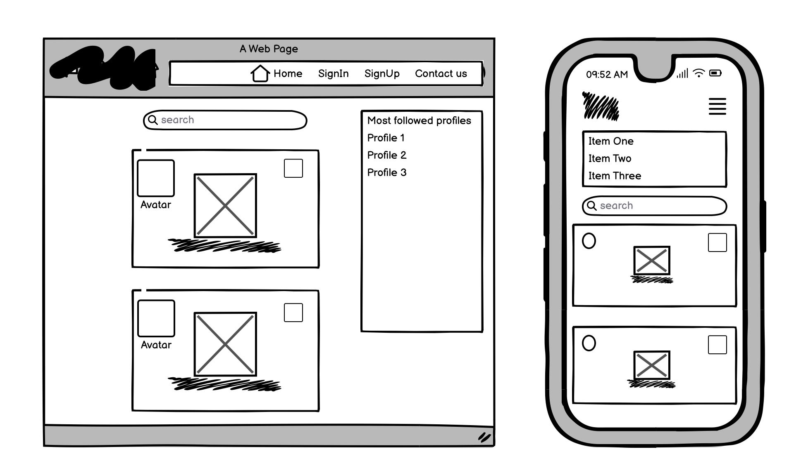
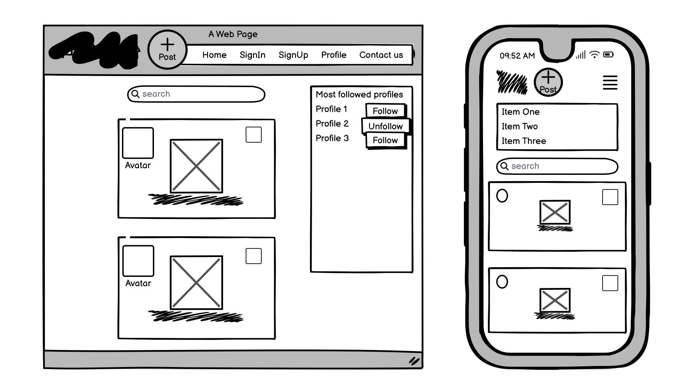

# GamesBlog

**Advanced Front-End Portfolio Project(PP5) - Code Institute**

View the deployed site [here.](https://gamesblog-front-34620d1947f3.herokuapp.com/)<br>

The Gamesblog frontend is the user interface component of the GamesBlog application, designed with React to provide an engaging and intuitive experience for users interacting with the social network. It connects with the [GamesBlog API](https://gamesblog-f53e2013614c.herokuapp.com/), enhancing user experience by offering a responsive and dynamic interface.
GamesBlog is an application for all the people who love playing videogames and want to share posts their favourite pictures of their favourite games with the option to comment and like.
GamesBlog want to create a community of people with common interest and with the with the possibility to follow and unfollow people with same passion,idea and why not interests.Once logged in with a specific account created,users can modify their profile with password and name included. 


<br>

## Table of contents

- [User Experience](#user-experience)
  - [Epics](#epics)
  - [User stories](#user-stories)
- [Design](#design)
  - [Wireframes](#wireframes)
  - [Logo](#logo)
  - [Favicon](#favicon)
  - [Typography](#typography)
- [Structure](#structure)
- [Features](#features)
- [Reusable Components](#reusable-components)
- [Bugs](#bugs)
- [Technologies Used](#technologies-used)
  - [Languages](#languages)
  - [Tools](#tools)
  - [Frameworks](#frameworks)
  - [Libraries and modules](#libraries-and-modules)
- [Testing](#testing)
  - [Validator Testing](#validator-testing)
  - [Lighthouse Test](#lighthouse-test)
  - [Manual testing](#manual-testing)
  - [Browser Compatibility](#browser-compatibility)
  - [Automated Testing](#automated-testing)
- [Deployment](#deployment)
  - [Heroku](#heroku)
  - [Run locally](#run-locally)
  - [Version control](#version-control)
  - [Local deployment](#local-deployment)
  - [Forking this GitHub repository](#forking-this-github-repository)
  - [Clone this repository](#clone-this-repository)
- [Credits](#credits)
  - [Code](#code)
  - [Acknowledgments](#acknowledgments)

### Epics


**Posts**

This epic is about the front end application where the users can create, read, update and delete their own posts. 

**Comments**

This epic is about the front end application where the users can create, read, update and delete their own comments.

**Profiles**

This epic is about the front end application where the users can create, read, update and delete their own profiles.  

**Likes**

This epic is about the front end application where the users can favourite certain posts they like and find them under the likes category when they are logged in.

**Home**

This epic is about the front end application for the home page where the users can see the most recent created posts, the most followed profiles and so on.

**Authentication** 

This epic is about the front end application where the users can choose to sign up, sign in and see if they are logged in or not.

**Navigation menu**

This epic is about the front end application where the users can use the navigation menu at the top of the page to get to the different pages.

### User Stories

**Home**

* As a user I can keep scrolling through the images on the site withouth changing page.
* As a user I can see a list of the most followed and popular profiles that i can be interested.
* As a user, I can search for posts and user with keywords.
* As a logged in user I can follow and unfollow other users so that I can see and remove posts by specific users.
* As a user I can navigate through pages quickly.

**Authentication** 

* As a user I can sign in to the app so that I can access functionality for logged in users.
* As a user I can tell if I am logged in or not.
* As a user I can maintain my logged-in status until I choose to log out so that my user experience is not compromised.
* As a user I can create a new account so that I can access all the features for signed up users.

**Navigation menu**

* As a user I can view a navbar from every page so that I can navigate easily between pages.
* As a logged out user I can see sign in and sign up options so that I can sign in/sign up again.

**Posts**

* As a logged in user I can create posts and share with community.
* As a user I can view all the most recent posts, ordered by list view.
* As a user I can view the details of a single post and to interact with it.
* As a post owner I can edit my post title and description so that I can make corrections or update my post after it was created.
* As an owner of a post I can delete my post.
* As a user I can view all the posts by a specific user.
* As a logged in user I can view content filtered by users I follow so that I can keep up to date.

**Comments**

* As a user I can view the posts page so that I can read the comments.
* As an owner of a comment I can delete my comment.
* As a user I can read comments on posts so that I can read what other users think about.
* As a logged in user I can add comments to a post.
* As a user I can see how long ago a comment was made.
* As an owner of a comment I can edit my comment so that I can fix or update my existing comment with the text.

**Profiles**

* As a user I can view other users profiles so that I can see their posts.
* As a logged in user I can update my username and password so that I can change my display name and use stronger passwords.
* As a logged in user I can edit my profile so that I can change my profile picture and bio description.
* As a user I can view statistics about a specific user: bio, number of posts, follows and users followed.
* As a user I can view user's avatars.

**Likes**

* As a logged in user I can like a post that i am interested or share same ideas.
* As a logged in user I can view the posts I have marked as a favourite.

**Developer**

* As a developer, I require a repository on GitHub for the front-end part of the project so that I have full control over the project versions.
* As a developer, I require a repository on Github for the api of the project so that I have full control over project versions.
* As a developer, I want to add a working kanban board to my repository so that I can track the tasks involved in creating the project.
* As a developer, I can automatically create a user profile when a new user signs up for my application so that the user has a profile ready for them upon registration.
* As a developer, I want to implement python test procedures so that I can assess functionality, usability, responsiveness, and data management throughout the web application.
* As a developer, I want to implement JavaScript test procedures so that I can assess functionality, usability, responsiveness, and data management throughout the web application.
* As a developer, I want to implement manual test cases so that I can assess functionality, usability, responsiveness, and data management throughout the web application.
* As a developer, I need to verify that my css files pass the W3C validation so that the code is executed correctly.
* As a developer, I need to verify that my JavaScript files pass the jshint validation so that the code is executed correctly.
* As a developer, I need to verify that my python files pass the pep8 validation so that the code is executed correctly.
* As an admin, I want to access the site's administrative features so that I have access to the admin panel.

## Design

### Wireframes

<details>
<summary> Home page </summary>
<br>
<br>

Wireframe for home page for logged-out user: <br>
<br>
Wireframes for home page for logged-in user:<br>
<br>

</details>

<details>
<summary> Sign Up & Sign In </summary>
<br>
<br>

<br>
<br>

</details>

<details>
<summary> Contact page </summary>
<br>
<br>

<br>

</details>

<details>
<summary> Profile Page </summary>
<br>
<br>

<br>

</details>

### Imagery
 
The logo for the project has been designed by me with [Canva](https://www.canva.com/).

#### Logo

<br>


#### Favicon

The favicon was created with [Favicon.io](https://favicon.io/favicon-generator/) by using the logo.<br>

  

#### Colour Scheme:
  

<details>
<summary> Click here to see the colour palette </summary>
<br>

I created this colour palette with [coloors](https://coolors.co/).<br>
<br>

</details>

### Typography

[DM Sans](https://fonts.google.com/specimen/DM+Sans?query=dm) Was used as font for the project.
## Structure 

All information about the structure can be found in the README of the API [here](https://github.com/t0tacci0/Gamesblog-backend)

## Reusable Components

Reusable components are a core principle in React. List of reusbale components in this project:<br>

**Avatar.js**<br>
The Avatar component was utilized across various parts of the application to ensure a consistent and user-friendly display of profile images and related text.The component Const Avatar is reused in: NavBar.js, Comment.js, CommentCreateForm.js, Post.js and Profile.js.

**Assets.js**<br>
 This component is designed to handle the display of a loading spinner, an image, or a message, depending on the props passed to it. <br>
It was utilized in various parts of the application. Here's how it was employed across different components:
"Not Found" component To display a placeholder image that provides a visual cue for the 404 error page,PostCreateForm.js, PostPage.js, PostsPage.js, PopularProfiles.js, ProfilePage.js.

**NavBar.js**<br>
The Navbar component played a central role in the application's navigation, offering a consistent and intuitive user experience across the site. The component const NavBar is considered a reusable component and is reused in: App.js.<br>

**NotFound.js**<br>
The NotFound component is a specialized component designed to handle 404 errors, providing users with a clear indication that the page they are trying to access does not exist.The const NotFound was also given a source of NoResults and this has been reused in: PostsPage.js and ProfilePage.js.

**MoreDropdown.js**<br>
This component is designed to show a dropdown menu. 
The component const MoreDropdown is considered a reusable component and is reused in: Comment.js, Post.js and ProfilePage.js.

**Post.js**<br>
This component is showing all the different posts that are created.
The component const Post is considered a reusable component and is reused in: PostPage.js and PostsPage.js.

**PostCreateForm.js**<br>
This component is designed to create the form where user can add new posts to the website. 
The component function PostCreateForm is considered a reusable component and is reused in: App.js.

**PopularProfiles.js**<br>
This component is designed to display a list of popular profiles, on both small mobile screens and larger computer screens.
The component const PopularProfiles is considered a reusable component and is reused in: PostPage.js, PostsPage.js and ProfilePage.js.

**ProfilePage.js**<br>
This component displays a user's profile information, including profile image, bio, follower counts, and their posts.
The function ProfilePage is considered a reusable component and is reused in: App.js.


## Technologies Used

### Languages:
- [CSS](https://en.wikipedia.org/wiki/CSS)
- [JavaScript](https://www.javascript.com/)

### Tools:
- [Git](https://git-scm.com/) Used in Gitpod terminal to commit to Git and Push to GitHub.
- [GitHub](https://github.com/) Used to store file for the project.
- [Heroku](https://www.heroku.com) Used to deploy application.
- [CI Gitpod](https://codeinstitute-ide.net/) IDE.
- [Code Insitute Database Maker](https://dbs.ci-dbs.net/) PostgreSQL database.
- [Fontawesome](https://fontawesome.com/) Used to add icons to the website.
- [Balsamiq](https://balsamiq.com/) Used to create the wireframes.
- [LanguageTool](https://languagetool.org/) Used to check the grammar and spelling in the README and the Code
- [Coloors](https://coolors.co/image-picker) Used to create the colour scheme.
- [Cloudinary](https://cloudinary.com/) Used to store the item images.
- [Canva](https://www.canva.com/) Used to create Logo.
- [Favicon.io](https://favicon.io/favicon-generator/) Used to create the favicon.
- [Google Chrome Dev Tools](https://developer.chrome.com/docs/devtools?hl=de) Used to check the application for responsiveness and errors. 

### Frameworks: 
- [React](https://react.dev/)
- [React Bootstrap](https://react-bootstrap.netlify.app/)
- [React Router Dom](https://reactrouter.com/en/main)

### Libraries and modules:
- [Axios](https://axios-http.com/docs/intro)
- [React Infinite Scroll Component](https://www.npmjs.com/package/react-infinite-scroll-component)

## Deployment

### Heroku
This site is deployed using Heroku. To deploy it from its GitHub repository to Heroku, I took the following steps:

1. Log in (or sign up) to Heroku
2. Click on the _New_ button and select _Create new app_
3. Give it a unique name and choose the region _Europe_
4. Click the *Deploy* tab, go to the _Deployment method_ section, select _GitHub_ and confirm this selection by clicking on the _Connect to Github_ button
5. Search for the repository name on github _GamesBlog-frontend_ and click the _Connect_ button
6. Inside the src folder add an api folder and create an axiosDefault.jsx
7. Add the link to the deployed version of the api as baseURL
8. Create a _Procfile_ in the root directory and add *web: npm run start*
9. In Heroku enable the automatic deploy or manually deploy the code from the main branch

To see the [view of the live site](https://gamesblog-front-34620d1947f3.herokuapp.com/) click on the _Open app_ button in the top right corner.

### Run Locally

Navigate to the GitHub Repository you want to clone to use locally:

- Click on the code drop down button
- Click on HTTPS
- Copy the repository link to the clipboard
- Open your IDE of choice (git must be installed for the next steps)
- Type git clone copied-git-url into the IDE terminal

The project will now have been cloned on your local machine for use.

Install Dependencies:

```npm install```

Run Application:

```npm start```

## Version Control

When I started this project I got this error below
            {
  opensslErrorStack: [
    'error:03000086:digital envelope routines::initialization error',
    'error:0308010C:digital envelope routines::unsupported'
  ],
  library: 'digital envelope routines',
  reason: 'unsupported',
  code: 'ERR_OSSL_EVP_UNSUPPORTED'
}

* To fix that error and to be able to run the server I added in the terminal:
1. nvm install 16
then 
2. nvm use 16
to fix that error and be able to open the server with the command: npm start.

### Forking this GitHub repository
1.  Log in to GitHub.
2.  Navigate to the repository for this project by selecting [*Gamesblog*](https://github.com/t0tacci0/gamesblog-frontend)
3. Click at the top of the repository on the **Fork** button on the right side

### Clone this repository
1. Log in to GitHub.
2. Navigate to the repository for this project by selecting [*Gamesblog*](https://github.com/t0tacci0/gamesblog-frontend)
3. In the top-right corner, click on the green *Code* button
4. Copy the HTTPS URL in the tab *Local*
5. Go to the code editor of your choice and open the terminal
5. Type `git clone` and paste the URL you copied into your terminal
6. Press the enter key

## Credits

### Code

- The initial setup and overall architecture of this project were guided by the Code Institute's Django Rest Framework walkthrough project. The core elements of the Profile, Follower, Like, Comment, along with their respective serializers, filtering capabilities, and tests, were derived from the walkthrough project and subsequently tailored to meet the unique requirements of this project.

- The following websites were used as a source of knowledge: <br>
  - [Google](www.google.com)
  - [mdn](https://developer.mozilla.org/en-US/)
  - [W3C](https://www.w3.org/)
  - [W3schools](https://www.w3schools.com/)
  - [DevDocs](https://devdocs.io/)
  - [Stack Overflow](https://stackoverflow.com/)
  - [reddit](https://www.reddit.com/)
  - [forum djangoproject](https://forum.djangoproject.com/)
  - [Django](https://www.djangoproject.com/), [Django Rest Framework]((https://www.django-rest-framework.org/)), [Cloudinary](https://cloudinary.com/documentation)
  - Slack Community

### Acknowledgements

- I would like to thank my mentor Mo Shami for his tips and assistance for the creation of this project.  
- Furthermore, I would like to give a shoutout to the wonderful tutor team who helped me numerous times when I was stuck and struggling to achieve the results I was aiming for. Your support and guidance have been amazing. Thank you!
- A big thank you for Slack community.

**This is for educational use.**  