# GamesBlog

**Advanced Front-End Portfolio Project(PP5) - Code Institute**

View the deployed site [here.](https://gamesblog-front-34620d1947f3.herokuapp.com/)<br>

The Gamesblog frontend is the user interface component of the GamesBlog application, designed with React to provide an engaging and intuitive experience for users interacting with the social network. It connects with the [GamesBlog API](https://gamesblog-f53e2013614c.herokuapp.com/), enhancing user experience by offering a responsive and dynamic interface.
GamesBlog is an application for all the people who love playing videogames and want to share posts their favourite pictures of their favourite games with the option to comment and like.
GamesBlog want to create a community of people with common interest and with the with the possibility to follow and unfollow people with same passion,idea and why not interests.Once logged in with a specific account created,users can modify their profile with password and name included. 


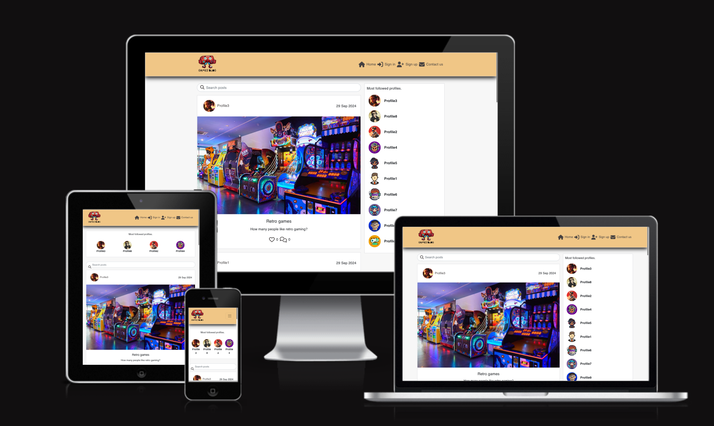<br>

## Table of contents

- [User Experience](#user-experience)
  - [Epics](#epics)
  - [User stories](#user-stories)
- [Design](#design)
  - [Wireframes](#wireframes)
  - [Logo](#logo)
  - [Favicon](#favicon)
  - [Typography](#typography)
- [Structure](#structure)
- [Features](#features)
- [Reusable Components](#reusable-components)
- [Bugs](#bugs)
- [Technologies Used](#technologies-used)
  - [Languages](#languages)
  - [Tools](#tools)
  - [Frameworks](#frameworks)
  - [Libraries and modules](#libraries-and-modules)
- [Testing](#testing)
  - [Validator Testing](#validator-testing)
  - [Lighthouse Test](#lighthouse-test)
  - [Manual testing](#manual-testing)
  - [Browser Compatibility](#browser-compatibility)
- [Deployment](#deployment)
  - [Heroku](#heroku)
  - [Run locally](#run-locally)
  - [Version control](#version-control)
  - [Local deployment](#local-deployment)
  - [Forking this GitHub repository](#forking-this-github-repository)
  - [Clone this repository](#clone-this-repository)
- [Credits](#credits)
  - [Code](#code)
  - [Acknowledgments](#acknowledgments)

## User Experience

I used an Agile methodology approach to plan this project. This was implemented through the GitHub Project board.\
During the development of the webpage i only focused on the ones i really needed.
The Kanban board can be seen [here](https://github.com/users/t0tacci0/projects/6/views/1).

### Epics


**Posts**

This epic is about the front end application where the users can create, read, update and delete their own posts. 

**Comments**

This epic is about the front end application where the users can create, read, update and delete their own comments.

**Profiles**

This epic is about the front end application where the users can create, read, update and delete their own profiles.  

**Likes**

This epic is about the front end application where the users can favourite certain posts they like and find them under the likes category when they are logged in.

**Home**

This epic is about the front end application for the home page where the users can see the most recent created posts, the most followed profiles and so on.

**Authentication** 

This epic is about the front end application where the users can choose to sign up, sign in and see if they are logged in or not.

**Navigation menu**

This epic is about the front end application where the users can use the navigation menu at the top of the page to get to the different pages.

### User Stories

**Home**

* As a user I can keep scrolling through the images on the site withouth changing page.
* As a user I can see a list of the most followed and popular profiles that i can be interested.
* As a user, I can search for posts and user with keywords.
* As a logged in user I can follow and unfollow other users so that I can see and remove posts by specific users.
* As a user I can navigate through pages quickly.

**Authentication** 

* As a user I can sign in to the app so that I can access functionality for logged in users.
* As a user I can tell if I am logged in or not.
* As a user I can maintain my logged-in status until I choose to log out so that my user experience is not compromised.
* As a user I can create a new account so that I can access all the features for signed up users.

**Navigation menu**

* As a user I can view a navbar from every page so that I can navigate easily between pages.
* As a logged out user I can see sign in and sign up options so that I can sign in/sign up again.

**Posts**

* As a logged in user I can create posts and share with community.
* As a user I can view all the most recent posts, ordered by list view.
* As a user I can view the details of a single post and to interact with it.
* As a post owner I can edit my post title and description so that I can make corrections or update my post after it was created.
* As an owner of a post I can delete my post.
* As a user I can view all the posts by a specific user.
* As a logged in user I can view content filtered by users I follow so that I can keep up to date.

**Comments**

* As a user I can view the posts page so that I can read the comments.
* As an owner of a comment I can delete my comment.
* As a user I can read comments on posts so that I can read what other users think about.
* As a logged in user I can add comments to a post.
* As a user I can see how long ago a comment was made.
* As an owner of a comment I can edit my comment so that I can fix or update my existing comment with the text.

**Profiles**

* As a user I can view other users profiles so that I can see their posts.
* As a logged in user I can update my username and password so that I can change my display name and use stronger passwords.
* As a logged in user I can edit my profile so that I can change my profile picture and bio description.
* As a user I can view statistics about a specific user: bio, number of posts, follows and users followed.
* As a user I can view user's avatars.

**Likes**

* As a logged in user I can like a post that i am interested or share same ideas.
* As a logged in user I can view the posts I have marked as a favourite.

**Developer**

* As a developer, I require a repository on GitHub for the front-end part of the project so that I have full control over the project versions.
* As a developer, I require a repository on Github for the api of the project so that I have full control over project versions.
* As a developer, I want to add a working kanban board to my repository so that I can track the tasks involved in creating the project.
* As a developer, I can automatically create a user profile when a new user signs up for my application so that the user has a profile ready for them upon registration.
* As a developer, I want to implement python test procedures so that I can assess functionality, usability, responsiveness, and data management throughout the web application.
* As a developer, I want to implement JavaScript test procedures so that I can assess functionality, usability, responsiveness, and data management throughout the web application.
* As a developer, I want to implement manual test cases so that I can assess functionality, usability, responsiveness, and data management throughout the web application.
* As a developer, I need to verify that my css files pass the W3C validation so that the code is executed correctly.
* As a developer, I need to verify that my JavaScript files pass the jshint validation so that the code is executed correctly.
* As a developer, I need to verify that my python files pass the pep8 validation so that the code is executed correctly.
* As an admin, I want to access the site's administrative features so that I have access to the admin panel.

## Design

### Wireframes

<details>
<summary> Home page </summary>
<br>
<br>

Wireframe for home page for logged-out user: <br>
<br>
Wireframes for home page for logged-in user:<br>
<br>

</details>

<details>
<summary> Sign Up & Sign In </summary>
<br>
<br>

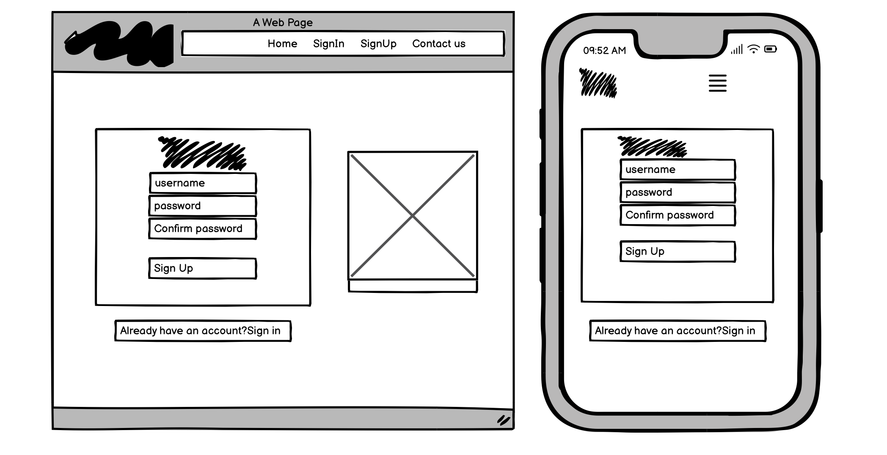<br>
<br>

</details>

<details>
<summary> Contact page </summary>
<br>
<br>

<br>

</details>

<details>
<summary> Profile Page </summary>
<br>
<br>

<br>

</details>

### Imagery
 
The logo for the project has been designed by me with [Canva](https://www.canva.com/).

#### Logo

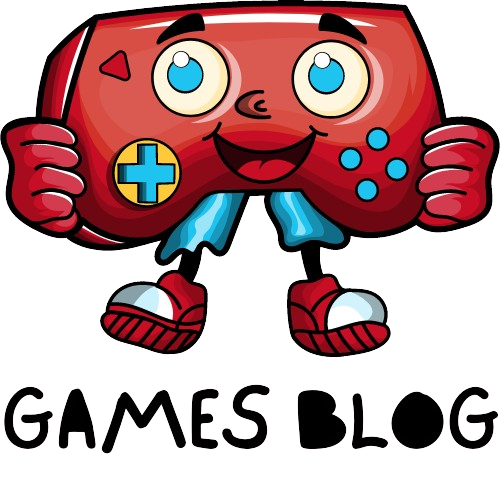<br>


#### Favicon

The favicon was created with [Favicon.io](https://favicon.io/favicon-generator/) by using the logo.<br>

  

#### Colour Scheme:
  

<details>
<summary> Click here to see the colour palette </summary>
<br>

I created this colour palette with [coloors](https://coolors.co/).<br>
<br>

</details>

### Typography

[DM Sans](https://fonts.google.com/specimen/DM+Sans?query=dm) Was used as font for the project.
## Structure 

All information about the structure can be found in the README of the API [here](https://github.com/t0tacci0/Gamesblog-backend)

## Features

**Home**

USER STORY:

`As a user I can keep scrolling through the images on the site, that are loaded automatically so that I don't have to click on "next page".

Implementation: 

It is important for a User to have a user-friendly interface for scrolling images. In this way a User can automatically scroll through all the posts. 

Link to user story: 
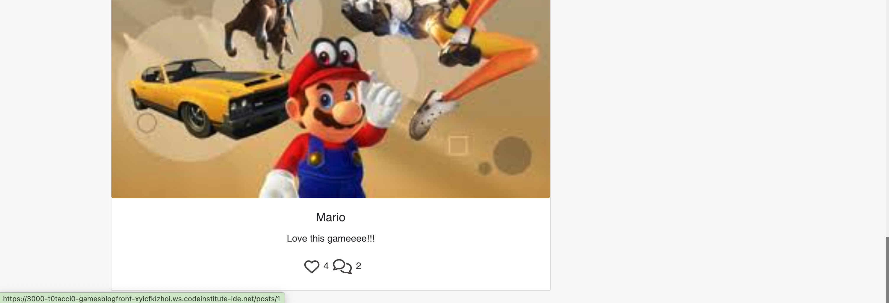

USER STORIY:

`As a user I can see a list of the most followed profiles so that I can see which profiles are popular`

Implementation: 

As a user it is a good feature to see the most popular profiles and decide if someone of them offers something they would like to follow too.

Link to user story: 
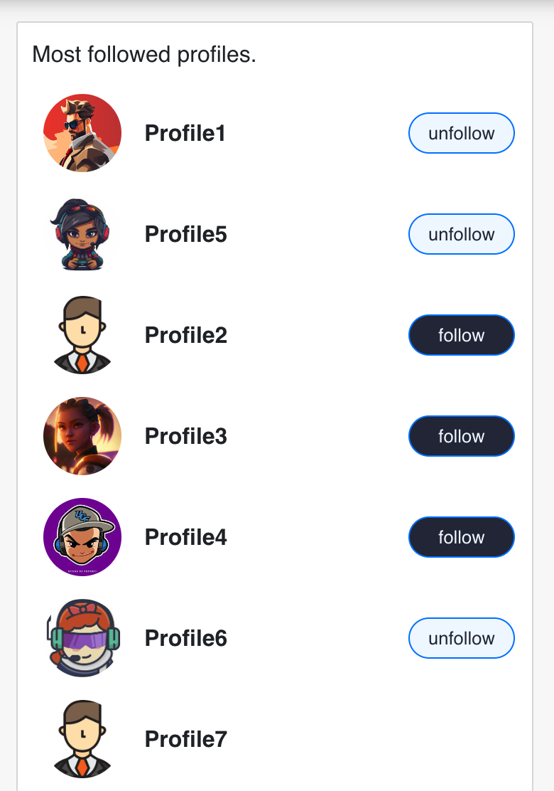

USER STORY:

`As a user, I can search for posts with keywords, so that I can find the posts and user profiles I am most interested in.`

Implementation: 

As a user it is a good feature to be able to search for a specific topic to find what you are looking for without having to search the entire website.
This is being done with the searchbar at the top of the webpage under the header.If no topic exists the specific "No results found. Adjust the search keyword." shows up.

Link to user story: 
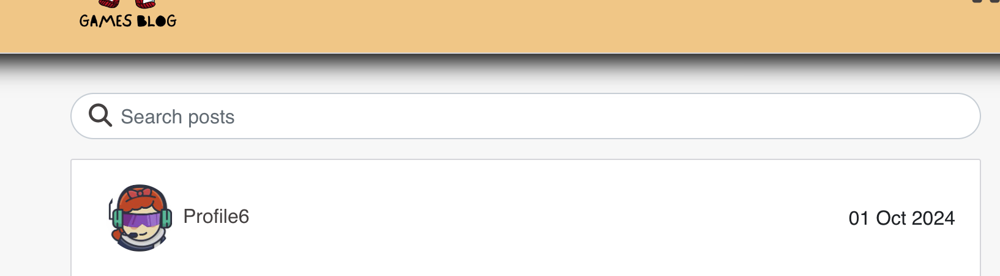

USER STORY:

`As a logged in user I can follow and unfollow other users so that I can see and remove posts by specific users in my posts feed`

Implementation: 

As a user it is a good feature to be able only see the content of the profiles you follow in its own page. So when a user choose to follow a profile and click the feed menu in the navigation bar they will get to a page which only shows posts from the users they have choosen to follow. 

Link to user story: 
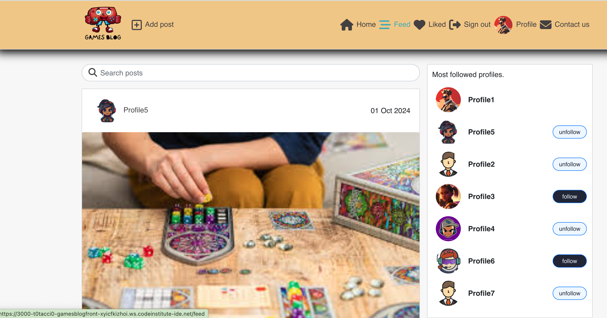

USER STORY:

`As a user I can navigate through pages quickly so that I can view content seamlessly without page refresh`

Implementation: 

As a user it is a good feature to be able to navigate through different pages quickly without having to wait for the page to refresh.
This is being done by a refresh token.

Link to user story:

**Authentication**

USER STORY:

`As a user I can sign in to the app so that I can access functionality for logged in users`

Implementation: 

As a user it is a good feature to be able to create a user for the webpage and be able to get access to certain functions. This is being created by clicking on the  heart next to a posts when logged in. That post is then saved to the like page, which the user can reach by clicking on the like menu in the navigation bar.

Link to user story: 
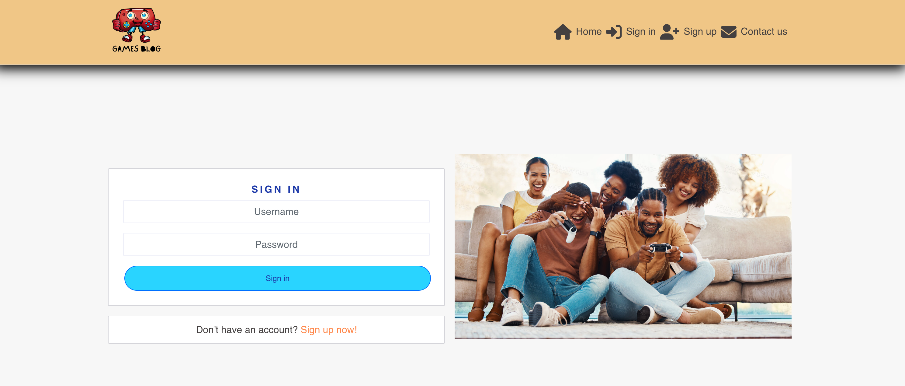

USER STORY:

`As a user I can tell if I am logged in or not so that I can log in if I need to`

Implementation: 

As a user it is a good feature to be able to see if you are logged in or not the webpage. When a user is logged in they can see the Sign out menu at the navigation bar. If the user is not logged in they can see the Sign in menu insted. 

Link to user story: 
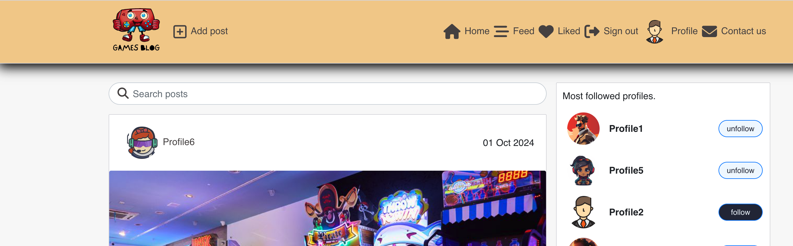

USER STORY:

`As a user I can maintain my logged-in status until I choose to log out so that my user experience is not compromised`

Implementation: 

As a user it is a good feature to be able to stay logged in for as long as you want to. This is being done by having a refresh token.

Link to user story: 

USER STORY:

`As a user I can create a new account so that I can access all the features for signed up users`

Implementation: 

As a user it is a good feature to be able to create your own user for the webpage to get access to all the features a logged in user gets. 
This is being done at the Sign up page with the Sign up form created.

Link to user story: 
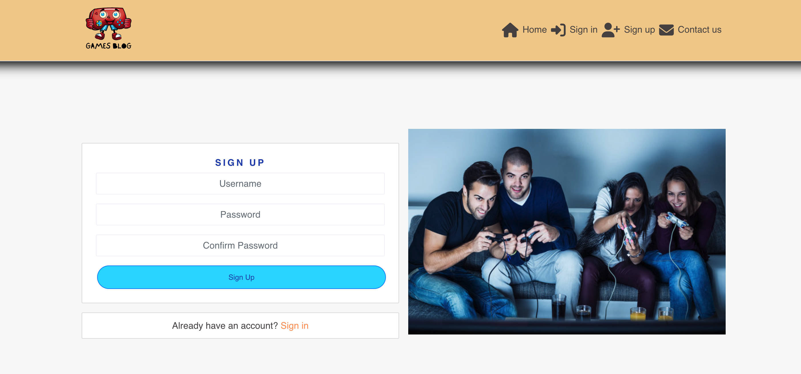

**Navigation menu**

USER STORY:

`As a user I can view a navbar from every page so that I can navigate easily between pages`

Implementation: 

As a user it is a good feature to be able to navigate to the different pages that the webpage offers without having to scroll or search for them.
This is being done with the navigation menu at the top of every page. The user can then click on the different menus in the navigation bar to get to the different pages.

Link to user story: 


USER STORY:

`As a logged out user I can see sign in and sign up options so that I can sign in/sign up`

Implementation: 

As a user it is a good feature to be able to see if your are logged in, or if you can create or sign in a user. This is being done with the Sign in/Sign up menus in the navigation bar, which only displays to logged out users. 

Link to user story: 


**Posts**

USER STORY:

`As a logged in user I can create posts so that I can share my images.`

Implementation: 

As a user it is a good feature to be able to share your own posts. This is being done with the add posts menu that is displayed only to logged in users in the navigation menu. When clicked the user is taken to a page where they can choose a image, title and content to then be able to press the create button to create the post.

Link to user story: 
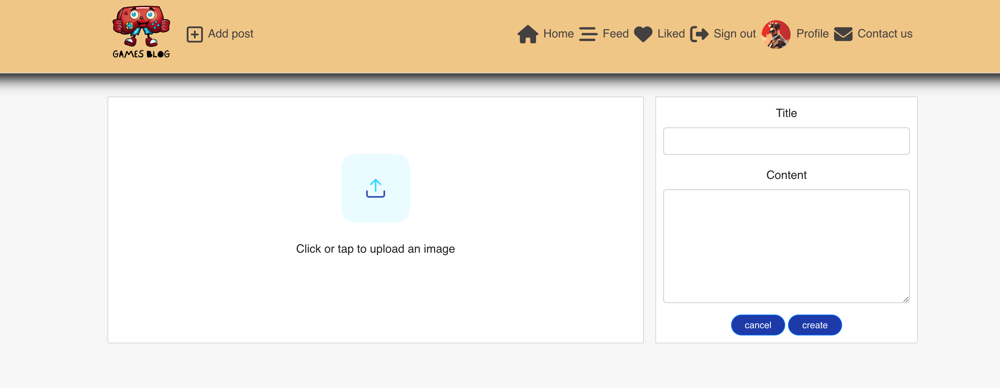

USER STORY:

`As a user I can view all the most recent posts, ordered by most recently created first so that I am up to date with the newest content`

Implementation: 

As a user it is a good feature to be able to see new posts that have been added to the webpage. This is being done at the home page where the newest post are at the top of the page. 

Link to user story: 
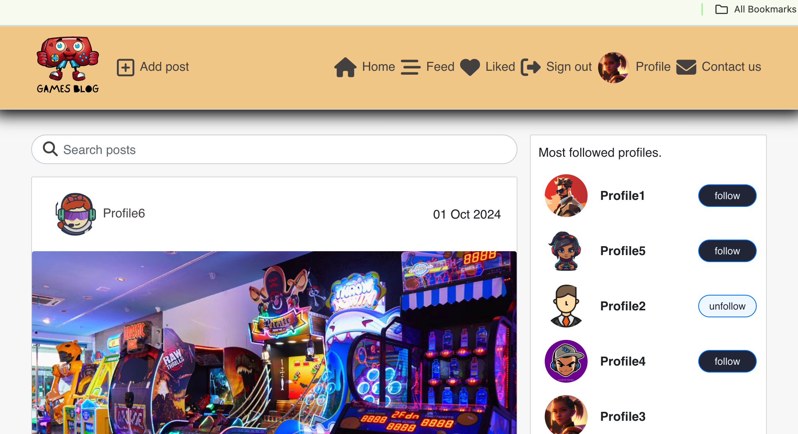


USER STORY:

`As a user I can view the details of a single post so that I can learn more about it`

Implementation: 

As a user it is a good feature to be able to see more information about a certain post that they are interested in. This is being done by clicking on a certain post.The user is then taking to a page which displays only that post and all information about it.

Link to user story: 
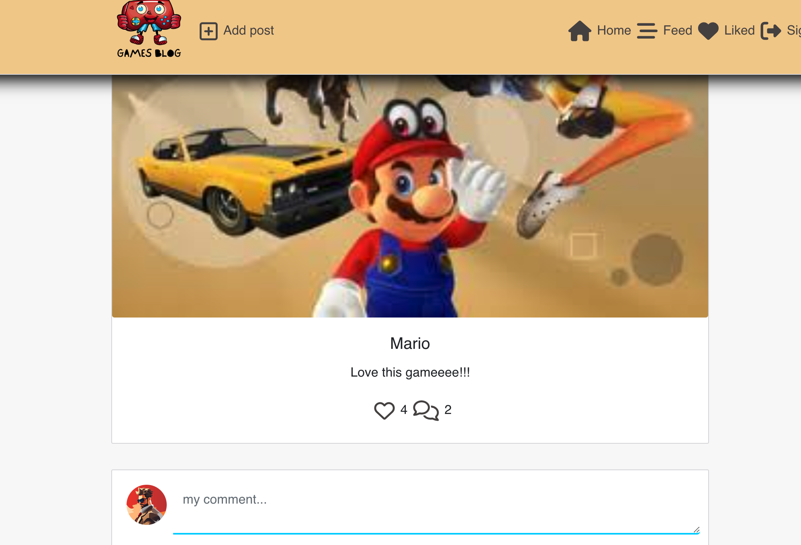

USER STORY:

`As a post owner I can edit my post title and description so that I can make corrections or update my post after it was created`

Implementation: 

As a user it is a good feature to be able to edit your own posts. This is being done with dropdown icon that appear next to the users own posts when they are logged in.When the user clicks on those dots they can choose to edit that post. They are then taken to a separate page where they can change the image, title or content. 

Link to user story: 
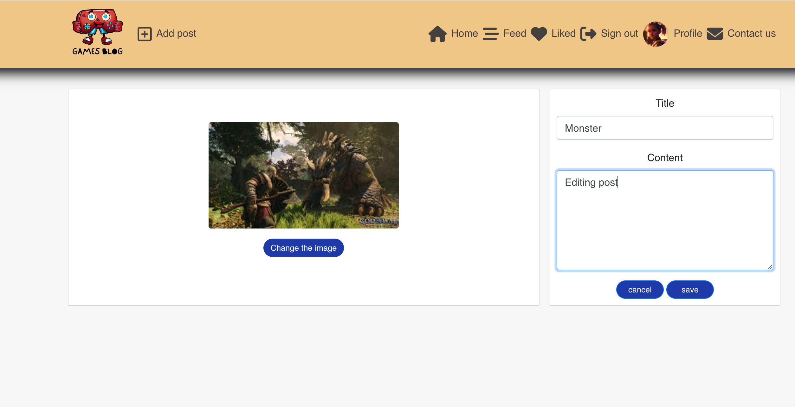

USER STORY:

`As an owner of a post I can delete my post so that I can control removal of my post from the application`

Implementation: 

As a user it is a good feature to be able to delete your own posts. This is being done with dropdown icon diplayed by the users own posts when they are logged in.The user needs to click on that certain post that they own to be able to see the dropdown icon. They can then click on those and choose the trashcan icon to delete that post.

Link to user story: 
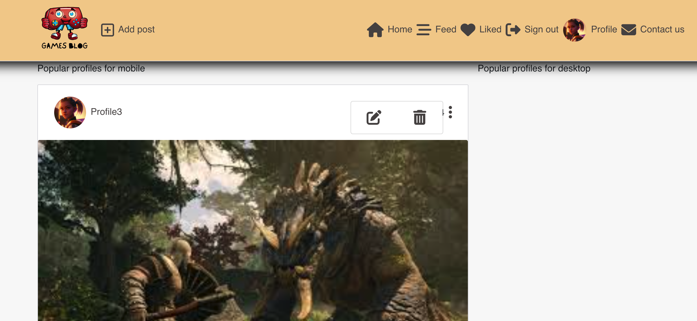

USER STORY:

`As a user I can view all the posts by a specific user so that I can catch up on their latest posts, or decide I want to follow them`

Implementation: 

As a user it is a good feature to be able to see all posts by a specific user. This is being done by clicking on that specific users avatar picture. You are then taken to that users profile page which diplays all posts that user have created. You can then choose if you want to follow that user or not.

Link to user story: 
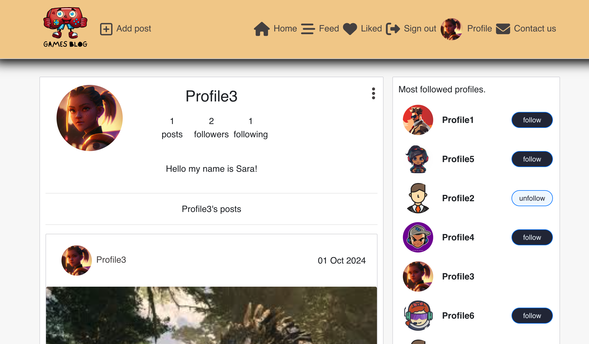


USER STORY:

`As a logged in user I can view content filtered by users I follow so that I can keep up to date with what they are posting about`

Implementation: 

As a user it is a good feature to be able to see all posts of the users you choose to follow. This is being done by adding all those users posts in a different page called Feed. That page is diplayed to logged in users in the navigation bar. The logged in user can then choose to click on the Feed menu and get to all the posts that only the users they follow have posted. 

Link to user story: 


**Comments**

USER STORY:

`As a user I can view the posts page so that I can read the comments about the post`

Implementation: 

As a user it is a good feature to be able to see all the different comments a post got. This is being done by clicking on a specific post. The user is then taken to that posts page where they can see the comments made at the bottom of the screen. 

Link to user story: 
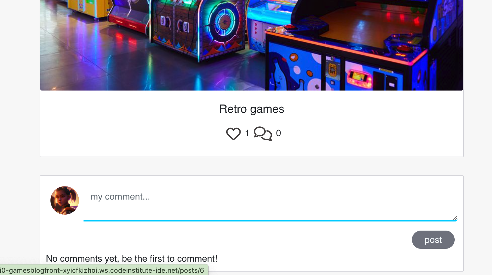

USER STORY:

`As an owner of a comment I can delete my comment so that I can control removal of my comment from the application`

Implementation: 

As a user it is a good feature to be able to delete your own comments. This is being done by going to a certain post that you have commented on. Next to your comment there is dropdown bar which you can press and choose the trashcan to delete that comment. 

Link to user story: 
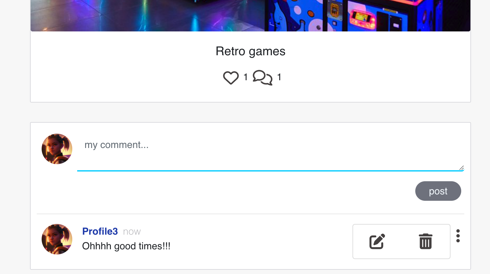

USER STORY:

`As a user I can read comments on posts so that I can read what other users think about the posts.`

Implementation: 

As a user it is a good feature to be able to read all the comments made to a post. This is being done by clicking on a post and scroll down to be bottom of that post where all the comments are. The user can then read all the comments. 

Link to user story: 
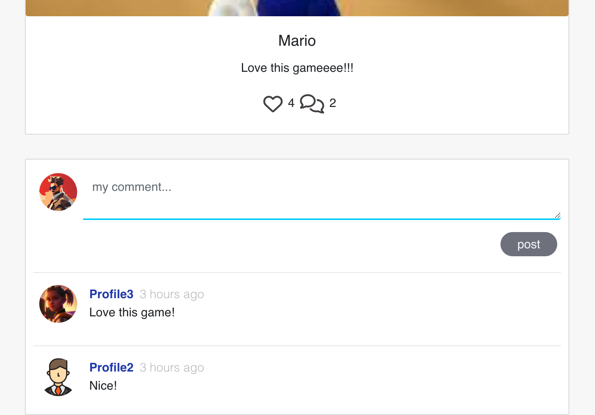

USER STORY:

`As a logged in user I can add comments to a post so that I can share my thoughts about the post.`

Implementation: 

As a user it is a good feature to be able to make your own comments to posts. This is being done by clicking on a post and scroll down to bottom of it. The user can then choose to fill in the comment form and then click on the post botton to create that comment. The user needs to be logged in for the comment form to appear.

Link to user story: 
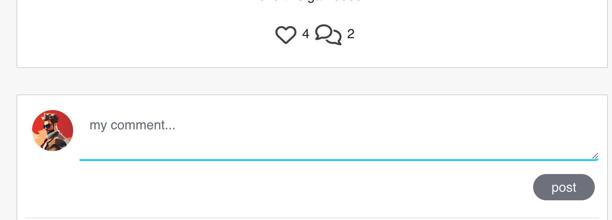

USER STORY:

`As a user I can see how long ago a comment was made so that I know how old a comment is`

Implementation: 

As a user it is a good feature to be able to see how long ago a comment was made. This is being done by clicking on a post and scroll down to all the comments.The user can then see next to the name of the person that made that comment, how long ago the comment was made. This is good to know so the user knows if the comment is new and relevant.

Link to user story: 
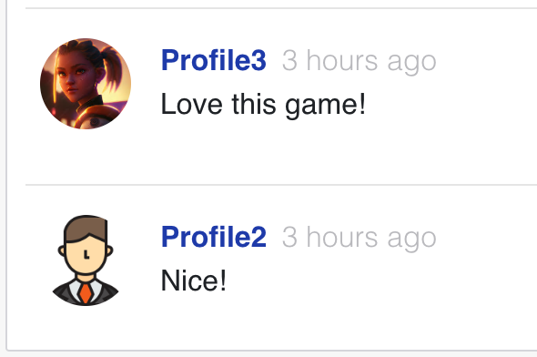

USER STORY:

`As an owner of a comment I can edit my comment so that I can fix or update my existing comment with the text.`

Implementation: 

As a user it is a good feature to be able to edit your own comments. This is being done by clicking on post you have commented on.
Then next to your own comment there is dropdown bar which you can click on to display a edit or delete icon. Click on the edit icon to display a form where you can edit your comments text. The user needs to be logged in to be able to see this function. 

Link to user story: 
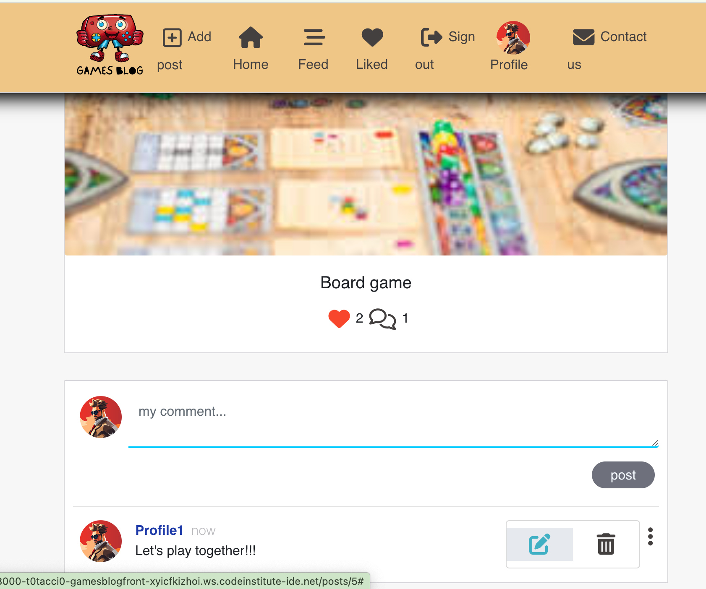


**Profiles**

USER STORY:

`As a user I can view other users profiles so that I can see their posts and learn more about them`

Implementation: 

As a user it is a good feature to be able to view other users profiles. This is being done by clicking on a certain users profiles avatar picture to get to that users profile page. The user can then see all the information and posts that specific user have created. 

Link to user story: 


USER STORY:

`As a logged in user I can update my username and password so that I can change my display name and keep my profile secure`

Implementation: 

As a user it is a good feature to be able to change your username or password when needed. The user needs to be logged in and press their own profile picture in the navigation menu. They are then taken to their own profile page. In the top right corner of the profile page there is dropdown bar which the user can click on to reveal 3 different menus. 2 of them being able to change the username or password. 

Link to user story: 
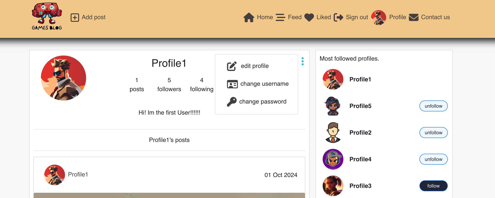

USER STORY:

`As a logged in user I can edit my profile so that I can change my profile picture and bio`

Implementation: 

As a user it is a good feature to be able to change your own profile image or bio. This is being done by clicking on your own profile picture when youre logged in. You can then click on the dropdown icon in the top right corner of your profile page to reveal the edit icon. Pressing you will be taken to a form where you can choose to change your profile image and bio text. 

Link to user story: 
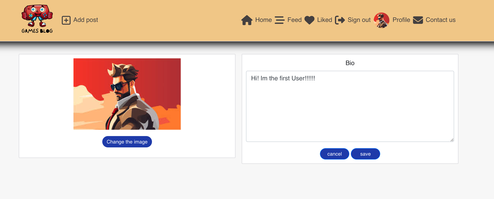

USER STORY:

`As a user I can view statistics about a specific user: bio, number of posts, follows and users followed so that I can learn more about them`

Implementation: 

As a user it is a good feature to be able to see different statistics about a certain user. This is being done by clicking on a specific users profile picture. The user is then taken to that specific users profile page where they can see statistics like: bio, number of posts, follows and users followed. 

Link to user story: 
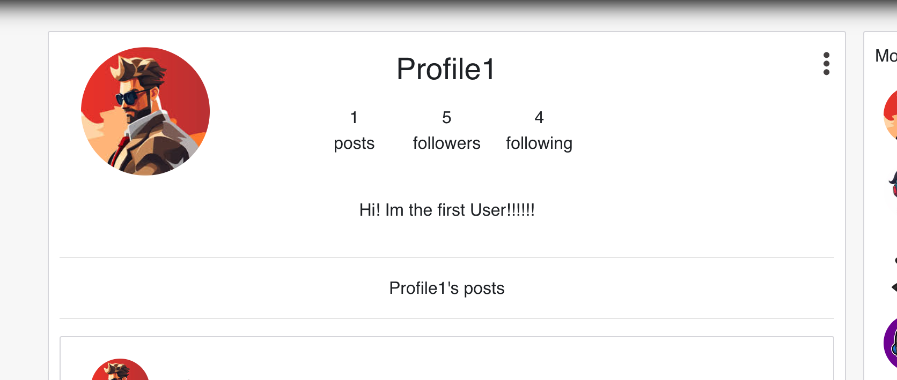

USER STORY:

`As a user I can view user's avatars so that I can easily identify users of the application`

Implementation: 

As a user it is a good feature to be able to see avatars of different users so you can identity them. This is being done by displaying a picture next to that users name. That user can then choose to add their own profile picture so other users can identify them easier. 

Link to user story: 
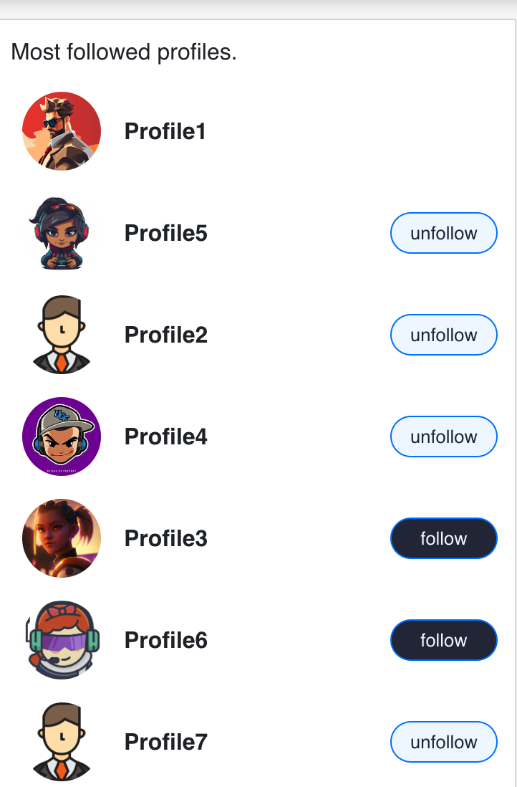

**Likes**

USER STORIE NR# 23:

`As a logged in user I can like a post so that I can show my support for the posts that interest me`

Implementation: 

As a user it is a good feature to be able to like post that you are interested in. This is being done by clicking on the heart icon that is displayed under the post image and text. 

Link to user story: 
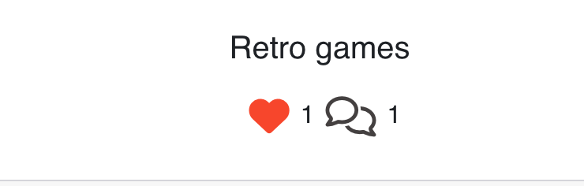

USER STORY:

`As a logged in user I can view the posts I have marked as a favourite so that I can find the posts I enjoy the most`

Implementation: 

As a user it is a good feature to be able to view the posts that the user have marked as their favourites. This is being done by adding all the posts the user have marked with the heart icon to the page called favourites. To see all the favourite posts the user can click on the favourites menu in the navigation bar to get to that page. 

Link to user story: 
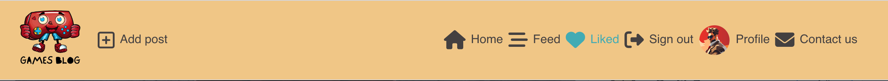

**Contact page**

USER STORY:

`As a user I want to be able to contact customer support if I got any questions relevant the website/user problematic`

Implementation: 

As a user it is a good feature to be able to contact the webpage owners if they got any questions. This is being done by clicking on the
Contact us menu in the navigation bar. The user is then taken to a contact form which they can fill in send a message to the webpage owners.

Link to user story: 
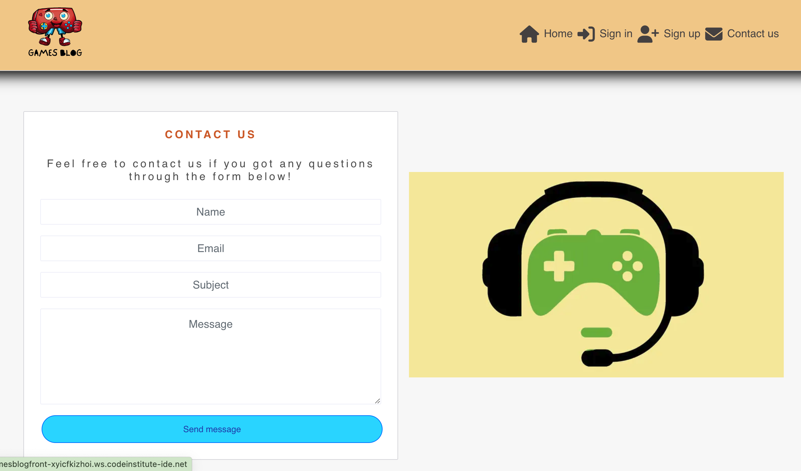


<br>

### Future Features

Features I want to add in future:
1. Star rating for picture.Users can rate from 1 to 5 stars and thihs showed as well on most popular profiles.
2. Section for movies inspired from games with posts and rating feature.


<hr>
<br>

## Reusable Components

Reusable components are a core principle in React. List of reusbale components in this project:<br>

**Avatar.js**<br>
The Avatar component was utilized across various parts of the application to ensure a consistent and user-friendly display of profile images and related text.The component Const Avatar is reused in: NavBar.js, Comment.js, CommentCreateForm.js, Post.js and Profile.js.

**Assets.js**<br>
 This component is designed to handle the display of a loading spinner, an image, or a message, depending on the props passed to it. <br>
It was utilized in various parts of the application. Here's how it was employed across different components:
"Not Found" component To display a placeholder image that provides a visual cue for the 404 error page,PostCreateForm.js, PostPage.js, PostsPage.js, PopularProfiles.js, ProfilePage.js.

**NavBar.js**<br>
The Navbar component played a central role in the application's navigation, offering a consistent and intuitive user experience across the site. The component const NavBar is considered a reusable component and is reused in: App.js.<br>

**NotFound.js**<br>
The NotFound component is a specialized component designed to handle 404 errors, providing users with a clear indication that the page they are trying to access does not exist.The const NotFound was also given a source of NoResults and this has been reused in: PostsPage.js and ProfilePage.js.

**MoreDropdown.js**<br>
This component is designed to show a dropdown menu. 
The component const MoreDropdown is considered a reusable component and is reused in: Comment.js, Post.js and ProfilePage.js.

**Post.js**<br>
This component is showing all the different posts that are created.
The component const Post is considered a reusable component and is reused in: PostPage.js and PostsPage.js.

**PostCreateForm.js**<br>
This component is designed to create the form where user can add new posts to the website. 
The component function PostCreateForm is considered a reusable component and is reused in: App.js.

**PopularProfiles.js**<br>
This component is designed to display a list of popular profiles, on both small mobile screens and larger computer screens.
The component const PopularProfiles is considered a reusable component and is reused in: PostPage.js, PostsPage.js and ProfilePage.js.

**ProfilePage.js**<br>
This component displays a user's profile information, including profile image, bio, follower counts, and their posts.
The function ProfilePage is considered a reusable component and is reused in: App.js.

## Bugs

I got for twice the same bug i described in the backend readme file.As i described i had to reset and create another database with the
help of tutor team.Unfortunately due to lack of time for the project i couldn't fix some bugs,but the project works good.

## Technologies Used

### Languages:
- [CSS](https://en.wikipedia.org/wiki/CSS)
- [JavaScript](https://www.javascript.com/)

### Tools:
- [Git](https://git-scm.com/) Used in Gitpod terminal to commit to Git and Push to GitHub.
- [GitHub](https://github.com/) Used to store file for the project.
- [Heroku](https://www.heroku.com) Used to deploy application.
- [CI Gitpod](https://codeinstitute-ide.net/) IDE.
- [Code Insitute Database Maker](https://dbs.ci-dbs.net/) PostgreSQL database.
- [Fontawesome](https://fontawesome.com/) Used to add icons to the website.
- [Balsamiq](https://balsamiq.com/) Used to create the wireframes.
- [LanguageTool](https://languagetool.org/) Used to check the grammar and spelling in the README and the Code
- [Coloors](https://coolors.co/image-picker) Used to create the colour scheme.
- [Cloudinary](https://cloudinary.com/) Used to store the item images.
- [Canva](https://www.canva.com/) Used to create Logo.
- [Favicon.io](https://favicon.io/favicon-generator/) Used to create the favicon.
- [Google Chrome Dev Tools](https://developer.chrome.com/docs/devtools?hl=de) Used to check the application for responsiveness and errors. 

### Frameworks: 
- [React](https://react.dev/)
- [React Bootstrap](https://react-bootstrap.netlify.app/)
- [React Router Dom](https://reactrouter.com/en/main)

### Libraries and modules:
- [Axios](https://axios-http.com/docs/intro)
- [React Infinite Scroll Component](https://www.npmjs.com/package/react-infinite-scroll-component)

## Testing

The app was tested regularly and deployed early to Heroku to make sure both local and remote worked the same.

### Validator Testing

<details>
<summary> HTML Validation</summary>
<br>

I passed my deployed html files through the [HTML Validator](https://validator.w3.org/nu/) and no errors were found for all pages:<br>
     
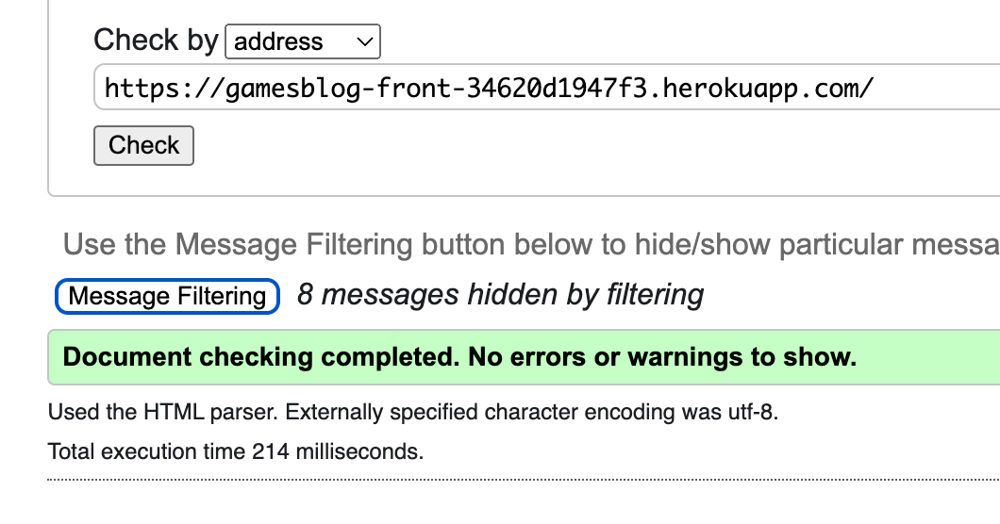

  
</details>

<details>
<summary> CSS Validation</summary>
<br>

I passed my deployed css file through the [CSS Validator](https://jigsaw.w3.org/css-validator/) and no errors were found.<br>
     
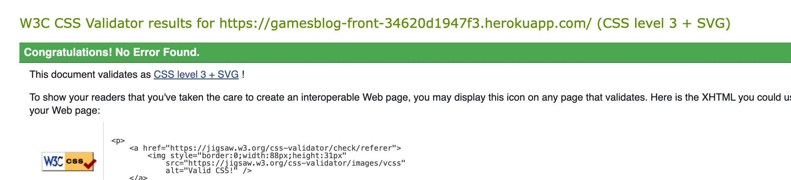
  
</details>

<details>
<summary> JavaScript Validation</summary>
<br>

I Checked the contactPage that i created for the project with no errors.


<br>
  
</details>

### Lighthouse Test
I used Google Lighthouse in Chrome Developer Tools to test the pages for Performance, Accessibility, Best Practices and SEO for mobile view. The third part, especially cookies, downgraded my score. Overall, this is something I would like to improve in the future with more time. 

Home page: <br>
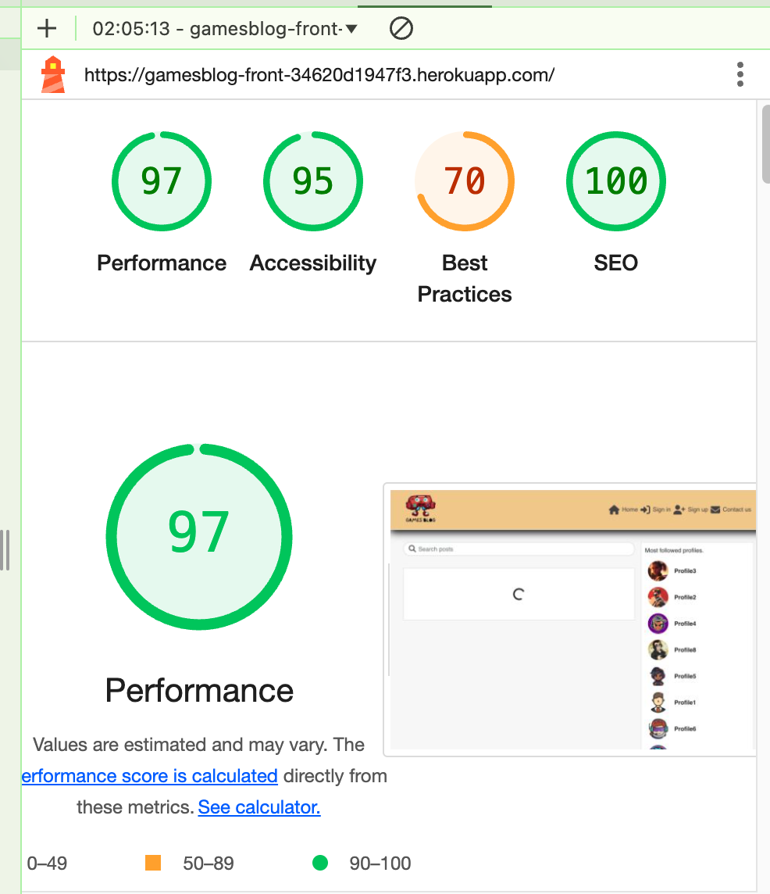<br>
Home page: <br>
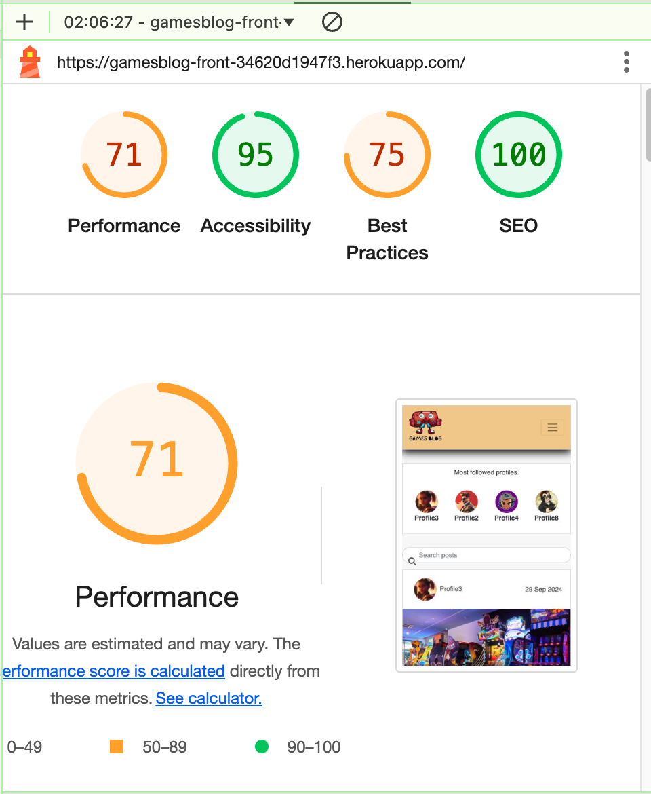<br>
Profile Page: <br>
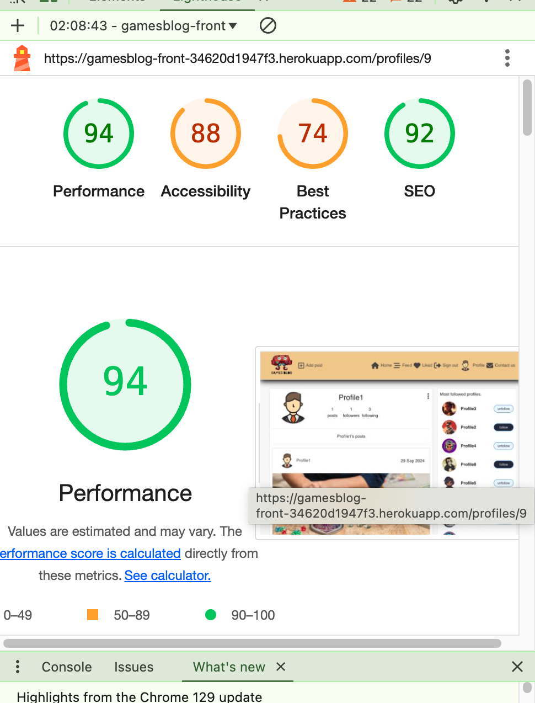<br>
Profile Page: <br>
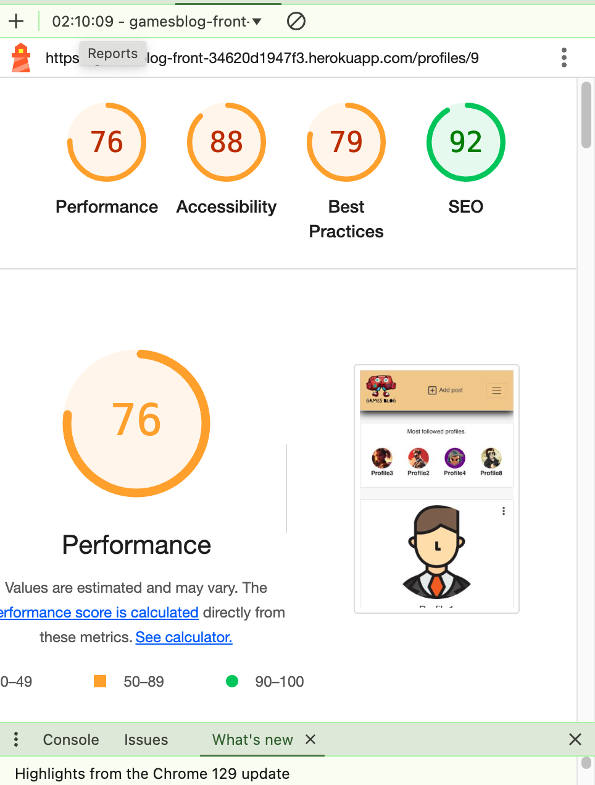<br>

### Manual Testing

<details>
<summary> Click here to see the testing table for features</summary>
<br>

| **Test** | **Test Description** | **Expected Outcome** | **Result** | 
|:---|:---|:---|:---|
| Header - Logo | Click on the logo to return to main page | Clicking on the logo on each page will return you to the main page | Pass |
| Header - Navbar toggle in tablet/mobile view | Click in tablet/mobile view on the burger icon to open the navigation | When the burger icon in mobile or tablet view is clicked, the navigation should open | Pass |
| Header - Close Navbar toggle in tablet/mobile view | Click outside of the toggeld navbar in tablet/mobile view | When clicking outside of the toggled navbar, the navbar should dissapear and the burger icon should be shown | Pass |
| Header - Navbar toggle inside the menu in tablet/mobile view | Click in tablet/mobile view on the burger icon to open the navigation and then click on Profile | When the user clicks Profile in mobile or tablet view, the dropdown should open | Pass |
| Header - Navigation link | Click on a term in the navigation bar to go to the corresponding page | Clicking on a page at the navigation bar should take the user to the corresponding page | Pass |
| Header - Navigation link (mobile view) | Click in the mobile view on a term in the navigation bar to go to the corresponding page and close the toggled burger menu | Clicking on a page at the navigation bar should take the user to the corresponding page and close the toggled burger menu | Pass |
| Header - Navigation links and items | Depending on whether the user is logged in or not, the navigation elements should adapt accordingly | After logging in, the navigation menu should adjust accordingly. | Pass |
| Favicon & Title | When opening the page or navigating within it, the favicon and the title should be visible. | After opening the page or navigating within it, tha favicon should be visible. | Pass |
| Sign Up | Fill out each field and click on the sign-me-up button. | After filling out every form field with validate input, and clicking the 'Sign Up' button, the user should be redirected to the verify email page and receive an email to verify the mail address | Pass |
| Sign Up - error message | Fill the username field with a username that is already existing or a pwassord that didn't match, and click on the sign-me-up button. | After entering a username that already exists or a password that doesn't match, and clicking the "sign me up" button, an error message should be displayed. | Pass |
| Sign In In | Log in with username and password | Clicking on the 'Log In' button after providing the correct username and password, the user should be redirected to the main page, and the navigation menu should change. In addition, a message that a successful login has taken place should be displayed. | Pass |
| Sign Out out | Click 'Sign out' in the navigation bar | After clicking on Log out, the user is logged out, redirected to the log in page, the navigation bar for logged out users is shown, and a message is displayed. | Pass |
| Redirect Logged In - Signup/Signin | Manually enter the URL for the Signup or Login page in the browser while logged in. | The user is redirected to the homepage, and the Signup/SignIn page is not accessible. | Pass |
| Redirect Logged out - Profile Page | Manually enter the URL for the user profile page in the browser while logged out. | The user is redirected to the homepage, and the profile page is not accessible. | Pass |
| User Profile Access - Logged In | Access the profile page via the navigation bar, "Most Active Profiles" section, participants section, or comments section by clicking on the username or profile picture. | The user should be able to access their profile page. | Pass |
| Profile Picture Display | Access the profile page where the user has not uploaded a picture. | A placeholder image featuring the Person avatar should be displayed. | Pass |
| Username Display | Access the profile page. | The username displayed should be the one created during the signup process. | Pass |
| Follow/Unfollow Button Visibility | Access the profile page of a user who is not the currently logged-in user. | The follow/unfollow button should be visible. Access the profile page of the logged-in user. | Pass |
| Followers and Following Counts | Access the profile page. | The number of followers and the number of people the user is following should be displayed accurately. | Pass |
| "Bio" Description | Access the profile page where the user has provided a description. | The description should be displayed if it is filled out. If not, the field should be show empty space. | Pass |
| Infinite Scroll | Access a profile page with more than 10 Profiles and scroll down. | Additional Profiles should load as the user scrolls, and a spinner should be briefly displayed during loading. | Pass |
| Edit Profile Button - Own Profile | Visit own profile page. | Three dots outlined in green should appear on the right side. Clicking these dots should reveal a dropdown menu with options to edit profile, username, or password. | Pass |
| Redirect to Edit Profile Page | Click on 'Edit Profile' from the dropdown menu. | The user should be redirected to the edit profile page with existing data pre-filled in the form. | Pass |
| Confirm Profile Changes | On the edit profile page, click 'Confirm Changes'. | The user should be redirected back to the profile overview page, and a success message should be displayed for 3 seconds. | Pass |
| Profile Editing - Success Message and Redirect | Save all changes to the profile, and click the save button. | A success message should be displayed, and the user should be redirected to the profile page. | Pass |
| Comment on a Post - log in required | Navigate to the detailed view of a Post and add a comment by typing in the comment section and clicking the "add comment" button. | The comment should be added, displayed in the comment section, and the comment count should increase by one. | Pass |
| Follow another User - log in required | Click on the Follow button in the "Most Followed Profiles" section. | The user should be marked as following, and the follower count on the followed user’s profile should increase by one. | Pass |
| Unfollow a User - log in required | Click on the Unfollow button in the "Most Followed Profiles" section. | The user should be marked as unfollowing, and the follower count on the unfollowed user’s profile should decrease by one. | Pass |
| Edit comment - log in and owner-status required | Click the three dots next to the comment you own and select "Edit". | The comment form should reopen with the existing content. The user should be able to update the comment by clicking "Save" or cancel the edit by clicking "Cancel". The updated comment should be displayed if saved. | Pass |
| Delete comment - log in and owner-status required | Click the three dots next to the comment you own and select "Delete". Confirm the deletion in the modal. | The comment should be removed from the list, and the comment count should decrease accordingly. | Pass |
| Redirect - logged-in user tries to access signup page | As a logged-in user, try to access the Signup page by typing the URL directly in the browser. | The user should be automatically redirected to the homepage. | Pass |
| Redirect - logged-in user tries to access login page | As a logged-in user, try to access the Login page by typing the URL directly in the browser. | The user should be automatically redirected to the homepage. | Pass |
| Redirect - logged-out user tries to access profile page | As a logged-out user, try to access a user profile page by typing the URL directly in the browser. | The user should be automatically redirected to the homepage. | Pass |
| Search bar | Write something in the search bar to see if it takes in the correspective post | The user should be taken to the correct post when using the searchbar and if no posts are found the "no results found" page displays. | Pass |
| Contact Page correct insert| Make sure that the contact form is working on the contact page. | The user should be taken to the contact page and be able to fill in the contact form and then press the Send message button to send the message. | Pass |
| Contact Page wrong email| Make sure that the contact form is not working on the contact page with wrong email field details. | When  click on the Contact Us link in the navigation menu fill wrong email information and pressed the Send message button.The message was displaying an error with "Enter a valid email address". | Pass |
| Feed Page | Make sure the feed page is working and only shows all posts of the profiles you have choosen to follow. | The user should be taken to the feed page when clicked on the feed link in the navigation menu. The user should only see posts from users the have choosen to follow. | Pass |
| Add Post | Make sure that the user can add their own post when logged in to the website, and that the post is showing on the posts page. | The user should be able to see a add post link in the navigation menu when logged in. The user should be able to create a new post that is added to the posts page. | Pass |
| Edit/Delete Post | Make sure that the user can edit/delete their own post when logged in to the website. | The user should be able to edit and delete their own posts with dropdown icon. | Pass |

</details>

### Browser Compatibility
  The tests were conducted using the following browser:

- Google Chrome Version 128.0.6613.113 <br>
Tests were also carried out for the following browsers using [browserling](https://www.browserling.com/) <br>
- Firefox 128
- Opera 112
- Brave 1.68
- Vivaldi 6.8
- Safari 17.4.1 

## Deployment

### Heroku
This site is deployed using Heroku. To deploy it from its GitHub repository to Heroku, I took the following steps:

1. Log in (or sign up) to Heroku
2. Click on the _New_ button and select _Create new app_
3. Give it a unique name and choose the region _Europe_
4. Click the *Deploy* tab, go to the _Deployment method_ section, select _GitHub_ and confirm this selection by clicking on the _Connect to Github_ button
5. Search for the repository name on github _GamesBlog-frontend_ and click the _Connect_ button
6. Inside the src folder add an api folder and create an axiosDefault.jsx
7. Add the link to the deployed version of the api as baseURL
8. Create a _Procfile_ in the root directory and add *web: npm run start*
9. In Heroku enable the automatic deploy or manually deploy the code from the main branch

To see the [view of the live site](https://gamesblog-front-34620d1947f3.herokuapp.com/) click on the _Open app_ button in the top right corner.

### Run Locally

Navigate to the GitHub Repository you want to clone to use locally:

- Click on the code drop down button
- Click on HTTPS
- Copy the repository link to the clipboard
- Open your IDE of choice (git must be installed for the next steps)
- Type git clone copied-git-url into the IDE terminal

The project will now have been cloned on your local machine for use.

Install Dependencies:

```npm install```

Run Application:

```npm start```

## Version Control

When I started this project I got this error below
            {
  opensslErrorStack: [
    'error:03000086:digital envelope routines::initialization error',
    'error:0308010C:digital envelope routines::unsupported'
  ],
  library: 'digital envelope routines',
  reason: 'unsupported',
  code: 'ERR_OSSL_EVP_UNSUPPORTED'
}

* To fix that error and to be able to run the server I added in the terminal:
1. nvm install 16
then 
2. nvm use 16
to fix that error and be able to open the server with the command: npm start.

### Forking this GitHub repository
1.  Log in to GitHub.
2.  Navigate to the repository for this project by selecting [*Gamesblog*](https://github.com/t0tacci0/gamesblog-frontend)
3. Click at the top of the repository on the **Fork** button on the right side

### Clone this repository
1. Log in to GitHub.
2. Navigate to the repository for this project by selecting [*Gamesblog*](https://github.com/t0tacci0/gamesblog-frontend)
3. In the top-right corner, click on the green *Code* button
4. Copy the HTTPS URL in the tab *Local*
5. Go to the code editor of your choice and open the terminal
5. Type `git clone` and paste the URL you copied into your terminal
6. Press the enter key

## Credits

### Code

- The initial setup and overall architecture of this project were guided by the Code Institute's Django Rest Framework walkthrough project. The core elements of the Profile, Follower, Like, Comment, along with their respective serializers, filtering capabilities, and tests, were derived from the walkthrough project and subsequently tailored to meet the unique requirements of this project.

- The following websites were used as a source of knowledge: <br>
  - [Google](www.google.com)
  - [mdn](https://developer.mozilla.org/en-US/)
  - [W3C](https://www.w3.org/)
  - [W3schools](https://www.w3schools.com/)
  - [DevDocs](https://devdocs.io/)
  - [Stack Overflow](https://stackoverflow.com/)
  - [reddit](https://www.reddit.com/)
  - [forum djangoproject](https://forum.djangoproject.com/)
  - [Django](https://www.djangoproject.com/), [Django Rest Framework]((https://www.django-rest-framework.org/)), [Cloudinary](https://cloudinary.com/documentation)
  - Slack Community

### Acknowledgements

- I would like to thank my mentor Mo Shami for his tips and assistance for the creation of this project.  
- Furthermore, I would like to give a shoutout to the wonderful tutor team who helped me numerous times when I was stuck and struggling to achieve the results I was aiming for. Your support and guidance have been amazing. Thank you!
- A big thank you for Slack community.

**This is for educational use.**  